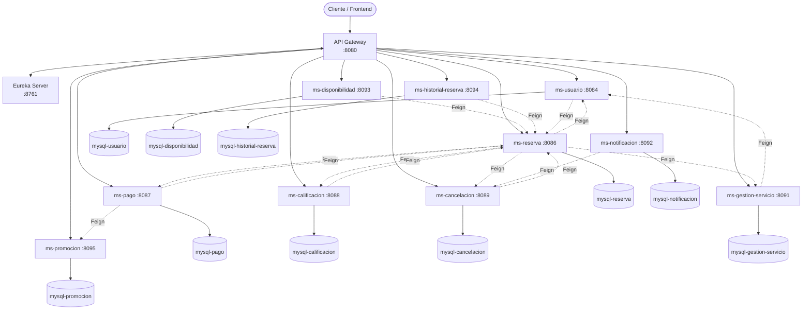
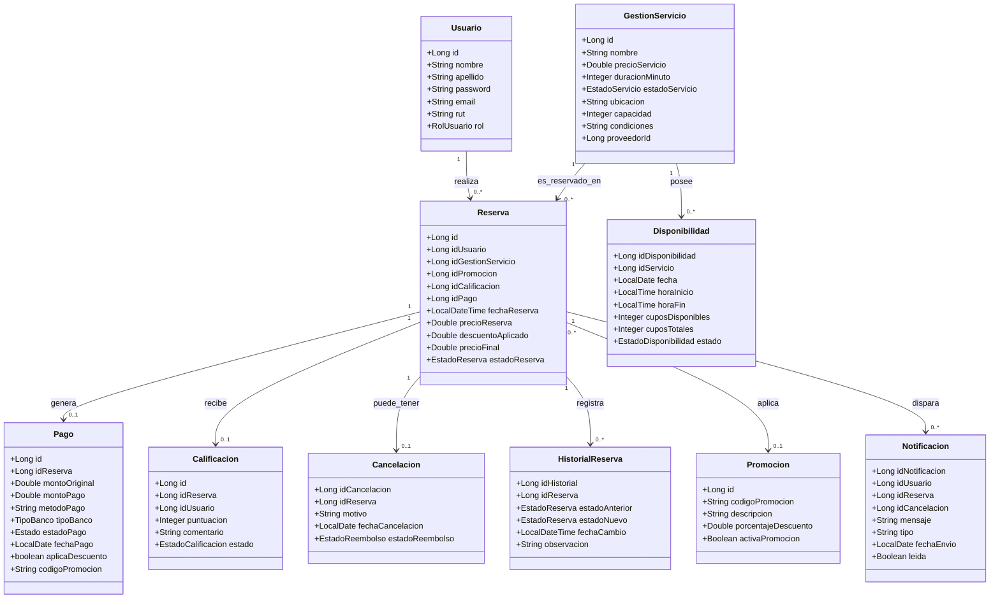
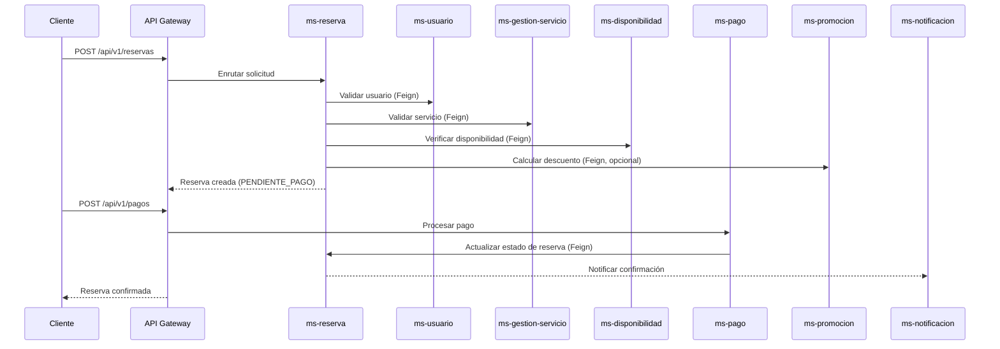

# ReservaPro

Sistema de gestión de reservas de servicios (por ejemplo, canchas, espacios o servicios en general) construido con una **arquitectura de microservicios** sobre el ecosistema Spring Cloud. Permite a los usuarios registrarse, consultar disponibilidad, reservar, pagar, calificar y cancelar servicios, con soporte para promociones, notificaciones e historial de cambios.

---
# Integrantes

1. Damian Mercado
2. Cindia Maldonado
3. Isaac Roman

---
## Tabla de contenidos

1. [Características del proyecto](#1-características-del-proyecto)
2. [Herramientas utilizadas](#2-herramientas-utilizadas)
3. [Estructura del proyecto](#3-estructura-del-proyecto)
4. [Cómo inicializar el proyecto](#4-cómo-inicializar-el-proyecto)
5. [Diagramas del proyecto](#5-diagramas-del-proyecto)

---

## 1. Características del proyecto

- **Arquitectura de microservicios** con 10 servicios de negocio + Service Discovery + API Gateway.
- **Base de datos por servicio** (*Database per Service*): cada microservicio tiene su propia base de datos MySQL, aislada del resto.
- **Comunicación síncrona entre servicios** mediante **OpenFeign**.
- **Descubrimiento de servicios** con **Netflix Eureka**.
- **Puerta de enlace única (API Gateway)** con Spring Cloud Gateway, enrutando por prefijo `/api/v1/...` hacia cada microservicio.
- **Documentación automática de APIs** con springdoc-openapi / Swagger UI en cada microservicio.
- **Migraciones de base de datos versionadas** con Flyway.
- **Manejo centralizado de excepciones** (`GlobalExceptionHandler`) por microservicio.
- **Mapeo objeto-DTO** con MapStruct y generación de boilerplate con Lombok.
- **Contenerización completa** de todos los servicios y bases de datos con Docker y Docker Compose.
- **Pruebas unitarias** (JUnit) para las capas de servicio de cada microservicio.

### Versiones principales

| Componente | Versión |
|---|---|
| Java | 17 |
| Spring Boot | 3.4.0 |
| Spring Cloud | 2024.0.0 |
| MySQL | 8.0 |
| MapStruct | 1.5.5.Final |
| Lombok | 1.18.34 |
| springdoc-openapi | 2.8.0 |
| Maven Compiler Plugin | 3.13.0 |
| Maven (imagen build) | 3.9 (eclipse-temurin-17) |

---

## 2. Herramientas utilizadas

**Lenguaje y framework**
- Java 17
- Spring Boot 3.4.0 (Web, Data JPA, Validation)
- Spring Cloud Gateway (WebMVC) — API Gateway
- Spring Cloud Netflix Eureka — Service Discovery
- Spring Cloud OpenFeign — comunicación entre microservicios
- Spring Security Crypto — cifrado de contraseñas

**Persistencia**
- MySQL 8.0 (una instancia/base de datos por microservicio)
- Spring Data JPA / Hibernate
- Flyway — versionado y migración de esquemas de BD

**Productividad / calidad de código**
- Lombok — reducción de código repetitivo (getters, setters, builders, etc.)
- MapStruct — mapeo entre entidades y DTOs

**Documentación**
- springdoc-openapi + Swagger UI (`/doc/swagger-ui.html` en cada servicio)

**Infraestructura y despliegue**
- Docker / Docker Compose — orquestación local de todos los microservicios y bases de datos
- Maven — gestión de dependencias y build

**Testing**
- JUnit 5 / Spring Boot Test

**Control de versiones**
- Git

---

## 3. Estructura del proyecto

El repositorio contiene la solución **ReservaPro**, compuesta por 12 módulos Maven independientes (cada uno con su propio `pom.xml`, se compilan y despliegan por separado):

```
Evaluacion-Semestral/
└── com.ReservaPro/
    ├── docker-compose.yml          # Orquesta todos los servicios y BDs
    │
    ├── eureka-server/              # Servidor de descubrimiento (puerto 8761)
    ├── gateway-service/            # API Gateway (puerto 8080)
    │
    ├── ms-usuario/                 # Gestión de usuarios (puerto 8084)
    ├── ms-reserva/                 # Gestión de reservas (puerto 8086)
    ├── ms-pago/                    # Gestión de pagos (puerto 8087)
    ├── ms-calificacion/            # Calificaciones de servicios (puerto 8088)
    ├── ms-cancelacion/             # Cancelaciones de reservas (puerto 8089)
    ├── ms-gestion-servicio/        # Catálogo/servicios ofrecidos (puerto 8091)
    ├── ms-notificacion/            # Notificaciones a usuarios (puerto 8092)
    ├── ms-disponibilidad/          # Disponibilidad de cupos (puerto 8093)
    ├── ms-historial-reserva/       # Historial de estados de reserva (puerto 8094)
    └── ms-promocion/               # Códigos de descuento/promoción (puerto 8095)
```

### Estructura interna de cada microservicio

Todos los microservicios de negocio siguen el mismo patrón por capas:

```
ms-<nombre>/
├── Dockerfile
├── pom.xml
└── src/
    ├── main/
    │   ├── java/com/ReservaPro/ms_<nombre>/
    │   │   ├── Ms<Nombre>Application.java   # Clase principal (@SpringBootApplication)
    │   │   ├── controller/                  # Endpoints REST (@RestController)
    │   │   ├── service/                     # Lógica de negocio
    │   │   ├── repository/                  # Interfaces Spring Data JPA
    │   │   ├── model/                       # Entidades JPA (@Entity)
    │   │   ├── dto/
    │   │   │   ├── request/                 # DTOs de entrada
    │   │   │   └── response/                # DTOs de salida
    │   │   ├── mapper/                      # Interfaces MapStruct
    │   │   ├── client/                      # Clientes Feign hacia otros microservicios
    │   │   ├── enums/                       # Enumeraciones de dominio
    │   │   ├── exception/                   # Excepciones propias + GlobalExceptionHandler
    │   │   └── config/                      # Configuración (Swagger, Security, etc.)
    │   └── resources/
    │       ├── application.properties       # Configuración del servicio (puerto, BD, Eureka)
    │       └── db.migration/                # Scripts Flyway (si aplica)
    └── test/
        └── java/.../service/                # Pruebas unitarias del servicio
```

### Módulos y su responsabilidad

| Microservicio | Responsabilidad | Puerto |
|---|---|---|
| `eureka-server` | Registro y descubrimiento de servicios | 8761 |
| `gateway-service` | Punto de entrada único, enrutamiento a microservicios | 8080 |
| `ms-usuario` | Registro y gestión de usuarios (clientes, operadores, administradores) | 8084 |
| `ms-reserva` | Creación y gestión del ciclo de vida de las reservas | 8086 |
| `ms-pago` | Procesamiento de pagos asociados a una reserva | 8087 |
| `ms-calificacion` | Calificación y comentarios sobre un servicio reservado | 8088 |
| `ms-cancelacion` | Cancelación de reservas y su reembolso | 8089 |
| `ms-gestion-servicio` | Catálogo de servicios ofrecidos (nombre, precio, ubicación, capacidad) | 8091 |
| `ms-notificacion` | Envío de notificaciones a usuarios | 8092 |
| `ms-disponibilidad` | Control de cupos/horarios disponibles por servicio | 8093 |
| `ms-historial-reserva` | Registro histórico de cambios de estado de una reserva | 8094 |
| `ms-promocion` | Códigos promocionales y cálculo de descuentos | 8095 |

Cada microservicio con persistencia tiene su propia base de datos MySQL en Docker (`mysql-usuario`, `mysql-reserva`, `mysql-pago`, etc.), cumpliendo el patrón *Database per Service*.

---

## 4. Cómo inicializar el proyecto

### Requisitos previos

- **Java 17** (JDK)
- **Maven 3.9+**
- **Docker** y **Docker Compose**
- Puertos libres en el rango `3307-3316` (bases de datos), `8080` (gateway), `8761` (eureka) y `8084-8095` (microservicios)

### Opción A — Levantar todo con Docker Compose (recomendado)

Esta es la forma más simple: construye las imágenes de cada microservicio y levanta las 10 bases de datos MySQL, Eureka, el Gateway y todos los microservicios en el orden correcto.

```bash
# 1. Ubicarse en la carpeta donde está el docker-compose.yml
cd com.ReservaPro

# 2. Construir y levantar todos los contenedores
docker compose up --build

# (Opcional) levantar en segundo plano
docker compose up --build -d

# Ver logs de un servicio puntual
docker compose logs -f ms-reserva

# Detener todo
docker compose down

# Detener y borrar también los volúmenes (datos de BD)
docker compose down -v
```

Al terminar de levantar, quedan disponibles, entre otros:

- Eureka Dashboard: `http://localhost:8761`
- API Gateway: `http://localhost:8080`
- Swagger de cada microservicio (vía Gateway o directo), ej: `http://localhost:8084/doc/swagger-ui.html`

### Opción B — Ejecutar los microservicios manualmente (modo desarrollo local)

Útil para depurar un servicio específico desde el IDE.

```bash
# 1. Levantar solo las bases de datos necesarias con Docker
cd com.ReservaPro
docker compose up mysql-usuario mysql-reserva mysql-pago -d   # agregar las que se necesiten

# 2. Levantar primero el servidor de descubrimiento
cd eureka-server
mvn spring-boot:run

# 3. Levantar el Gateway
cd ../gateway-service
mvn spring-boot:run

# 4. Levantar cada microservicio necesario (en terminales separadas)
cd ../ms-usuario
mvn spring-boot:run
```

> Cada microservicio toma su configuración desde `application.properties`, usando variables de entorno con valores por defecto, por ejemplo:
> `DB_URL`, `DB_USER` / `DB_USERNAME`, `DB_PASSWORD`, `EUREKA_URL`.
> Por defecto apuntan a `localhost` si no se definen (ideal para desarrollo local).

### Compilar un microservicio individualmente

```bash
cd ms-<nombre-del-servicio>
mvn clean install          # compila y corre tests
mvn clean package -DskipTests   # compila sin correr tests
```

### Orden recomendado de arranque

1. Bases de datos MySQL
2. `eureka-server`
3. `gateway-service`
4. `ms-usuario`
5. Resto de microservicios (`ms-reserva`, `ms-pago`, `ms-calificacion`, `ms-cancelacion`, `ms-promocion`, `ms-gestion-servicio`, `ms-notificacion`, `ms-disponibilidad`, `ms-historial-reserva`)

Docker Compose ya respeta este orden mediante `depends_on` con `condition: service_healthy` / `service_started`.

---

## 5. Diagramas del proyecto

### 5.1 Diagrama de arquitectura (microservicios)



### 5.2 Diagrama de clases (entidades principales)



> **Nota:** al ser microservicios independientes con base de datos propia, las relaciones entre entidades de distintos servicios (por ejemplo `Reserva → Usuario`) **no son claves foráneas de base de datos**, sino referencias por ID que se resuelven en tiempo de ejecución mediante llamadas Feign entre servicios.

### 5.3 Diagrama de secuencia — Flujo de una reserva



---
